# 🧠 SYSTEM ARCHITECTURE OS: "The ROI Engine"
> **Snapshot Date:** 2026-02-06
> **Objective:** Maximize ROAS (Return on Ad Spend) | Minimize CPE/CPM | Zero Data Loss

## 1. The Core Philosophy (Silicon Valley Standard)
This system is not "just a website". It is a **Data Capture & Conversion Machine** designed to survive the hostile environment of the open internet (Bots, Latency, Ad Blockers) and feed Meta's algorithm with High-Fidelity Signals.

### 🎯 The "ROI Algorithm"
$$ ROI = \frac{(Traffic \times Conversion \times LTV)}{CPA} $$
We engineered the architecture to boost the numerator and crush the denominator:
*   **Boots Traffic (SEO):** Sitemap.xml, Schema, Srcset.
*   **Boots Conversion (UX):** TTFB < 100ms, Dynamic Landing Pages, Sticky CTA.
*   **Drops CPA (Signal):** 100% Match Rate (CAPI + Pixel), Deduplication (UUID), Turnstile (No Bot Spend).

---

## 2. The Architectural Graph (The Flow)

```mermaid
graph TD
    User((User 📱)) -->|Request| CF{Cloudflare Edge 🛡️}
    
    subgraph "The Shield (Edge Layer)"
        CF -->|Valid User| Cache[Edge Cache ⚡]
        CF -->|Bot| Turnstile[Block 🚫]
        CF -->|Script| Zaraz[Async Tracking 🎯]
    end

    subgraph "The Brain (Compute Layer)"
        Cache -->|Miss| Vercel[FastAPI Serverless 🐍]
        Vercel -->|Page Render| Jinja2[Dynamic HTML 🎨]
        Vercel -->|Protect| RateLimit[Redis Limiter 🛑]
    end

    subgraph "The Memory (Data Layer)"
        Vercel -->|Read/Write| Supabase[(Postgres Pooler 🐘)]
        Vercel -->|Bg Task| QStash[Upstash Queue 📨]
    end

    subgraph "The Feedback Loop (Ad Tech)"
        QStash -->|Retry| MetaCAPI[Meta Graph API ♾️]
        Zaraz -->|Direct| MetaPixel[Meta Browser Pixel 👾]
    end

    User -->|View| MetaPixel
    MetaCAPI -->|Event Match| MetaAds[Ads Optimization 🧠]
    MetaAds -->|Lower CPA| User
```

---

## 3. The "Engine" Components & Decisions

### 🚀 A. The Compute Engine: Vercel + FastAPI
*   **Decision:** Why not Django/VPS?
*   **Why:** We need **Serverless Scalability** without DevOps. Vercel handles spikes from ad campaigns automatically. FastAPI gives us Python power (data processing) with async speed.
*   **Blind Spot Fixed:** Added `maxDuration: 60` to `vercel.json` to prevent serverless timeouts during heavy processing.

### ⚡ B. The Resilience Engine: Upstash QStash
*   **Decision:** Why not Celery/RabbitMQ?
*   **Why:** Traditional queues break in Serverless (no persistent workers). **QStash** is HTTP-based. It allows us to "fire and forget" tracking events. If Meta is down, QStash retries automatically. **Zero Data Loss.**

### 🐘 C. The Memory Engine: Supabase (Transaction Mode)
*   **Decision:** Why PGBouncer?
*   **Why:** Serverless functions open 1 connection per request. 1000 visitors = 1000 connections = Crash. Using **Port 6543 (Transaction Pooler)** allows thousands of users to share ~20 connections.

### 🛡️ D. The Security Engine: Redis + Turnstile
*   **Decision:** Why Rate Limit?
*   **Why:** Competitors or Bots can drain your QStash/Vercel quota. `slowapi` backed by **Upstash Redis** ensures no IP can hit the API more than 60 times/minute. Turnstile ensures you never pay for a bot click.

### 🎨 E. The UX Engine: Dynamic Jinja2
*   **Decision:** Why not React/Next.js?
*   **Why:** For this specific use case (Landing Page), **HTML Generation (SSR)** is faster (TTFB) and better for SEO than hydrating a heavy React bundle.
*   **Evolution:** We added `utm_campaign` logic. If user searches "Brows", page says "Brows". Context = Conversion.

---

## 4. The "Secret Sauce" (Learnings)

1.  **The "Connection Bomb":** Never use Port 5432 in Vercel. Always 6543.
2.  **The "Silent Death":** Serverless freezes background threads. Always offload to external HTTP queues (QStash).
3.  **The "Signal Gap":** Browser tracking is dead (iOS14). Server-side tracking (CAPI) is the only way to lower CPA.
4.  **The "Context Law":** A generic homepage kills ROI. Dynamic headlines based on UTMs are mandatory.
